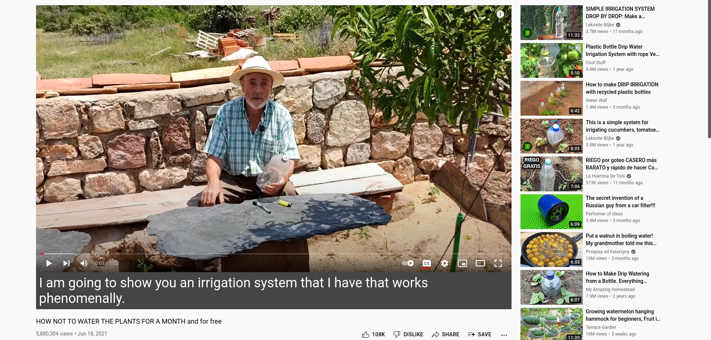
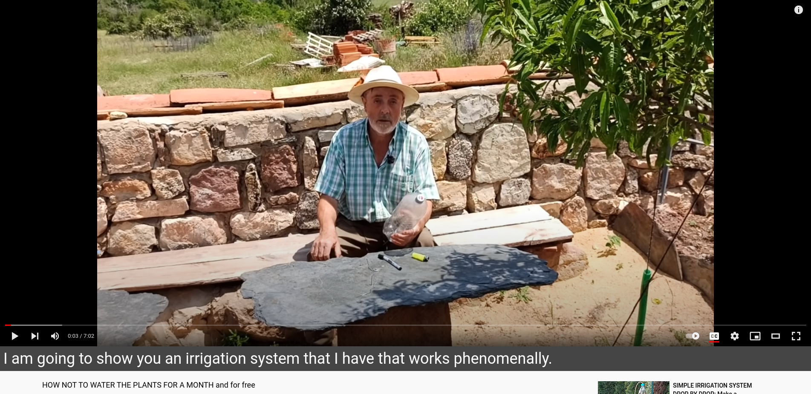

## Description

Large subtitles in YouTube for education purpose

## Usage example

normal:

wide:

## Meta

Icons provided by [pixel-perfect](https://www.flaticon.com/authors/pixel-perfect)
Minimum Chrome version: 88

## License

[MIT](./LICENSE)